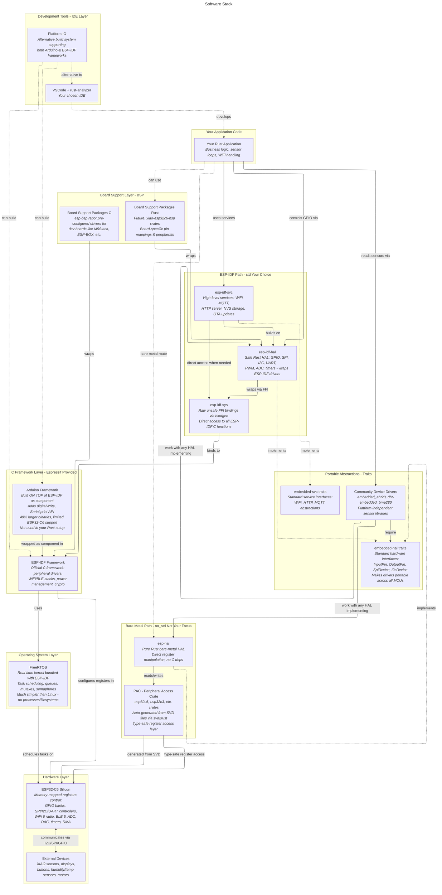

# Rust on ESP32-C6

## Prerequisites
- Install rust via `curl --proto '=https' --tlsv1.2 -sSf https://sh.rustup.rs | sh`
- restart restart terminal to source rust `. "$HOME/.cargo/env"`
- get ESP Rust Toolchain `cargo install espup`
- setup ESP Rust Toolchain `espup install`
- add `'. /home/robby/export-esp.sh'` to bashrc
- install the template generator `cargo install esp-generate `
- `cargo install espflash --locked`
- `curl --proto '=https' --tlsv1.2 -LsSf https://github.com/probe-rs/probe-rs/releases/latest/download/probe-rs-tools-installer.sh | sh`
- `cargo install esp-config --features=tui --locked`

### For ESP-IDF-HAL Usage
- `sudo apt-get install git wget flex bison gperf python3 python3-pip python3-venv cmake ninja-build ccache libffi-dev libssl-dev dfu-util libusb-1.0-0`
- Do not follow the whole ESP-IDF Installation and instead
- install rust (done)
```sh
cargo install cargo-generate
cargo install ldproxy
# installed previoulsly:
# cargo install espup
# cargo install espflash
# cargo install cargo-espflash # Optional
# sudo apt-get install libudev-dev
```

Finally initialize the folder by executing `cargo generate esp-rs/esp-idf-template cargo`

### VSCode Extensions
- rust-analyzer
- Wokwi with account and 30day license
- dependi for crates mgmt


## Setup via esp-generate

Use `esp-generate --chip esp32c6 myproject` and follow configuration as necessary with probe-rs

## Run

`cargo run` build the binaries that can then be simulated via Wokwi


## Useful Links
- [Three LED on Xiao ESP32-C6](https://wokwi.com/projects/411265368570177537)
- [Wiki - XIAO ESP32-C6 Getting Started ](https://wiki.seeedstudio.com/xiao_esp32c6_getting_started/)
- [Wokwi ESP32 Guide](https://docs.wokwi.com/guides/esp32)
- [Github Awesome Embedded Rust](https://github.com/rust-embedded/awesome-embedded-rust)

### ESP-IDF
- [ESP32-C6 IDF API Reference](https://docs.espressif.com/projects/esp-idf/en/latest/esp32c6/api-reference/index.html)
- [Github ESP-IDF-HAL Crate](https://github.com/esp-rs/esp-idf-hal?tab=readme-ov-file)

## Architectural Overview of Embedded Rust via ESP-IDF



## Hardware Overview
- ESP32-C6 from seeedstudio xiao series
  - 160MHz 320KB ROM, 512KB SRAM
  - RiscV core, ble, wifi, thread
  - 20mHz low power core
- Xiao Starter Kit
  - Xiao Expansion Board
    - OLED Display: SSD1306
    - clock: PCF8563
  - several other Grove Sensors
- ePaper Driver board
  - battery & power mgmt: ETA9740
  - 2"-bw-epaper display: ssd1680
- xiao ml kit:
  - https://www.mlsysbook.ai/contents/labs/seeed/xiao_esp32s3/setup/setup.html
  - ESP32-S3 xtensa-based chip
    - dual core 240MHz
    - 8MB PSRAM 8MB Flash, 32GB SD-card 
    - wifi, 14uA deep sleep
  - 6-axis-imu: LSM6DS3TR-C 0x6a
  - camera: OV2640 
  - OLED: SSD1306 0x3c

next:
- esp32-p4
  - dual core 400MHz
  - Memory 
    - 128 KB of high-performance system ROM
    - 768 KB of high-performance (HP) L2 memory (L2MEM)
    - 32 KB of low-power (LP) SRAM
    - 32 MB PSRAM stacked in the package, and the QSPI interface is connected to 16MB Nor Flash
  - additional ESP32-C6 for connectivity
  - PoE, Mipi-CSI, Mipi-DSI
  - [ESP Wiki](https://www.waveshare.com/wiki/ESP32-P4-Nano-StartPage#Overview)

## First C6 COnnection:

```sh
# sudo dmesg
[  187.639563] usb 1-1: new full-speed USB device number 5 using xhci_hcd
[  187.767728] usb 1-1: New USB device found, idVendor=303a, idProduct=1001, bcdDevice= 1.02
[  187.767745] usb 1-1: New USB device strings: Mfr=1, Product=2, SerialNumber=3
[  187.767751] usb 1-1: Product: USB JTAG/serial debug unit
[  187.767755] usb 1-1: Manufacturer: Espressif
[  187.767759] usb 1-1: SerialNumber: 98:A3:16:8E:C7:C0
[  187.805522] cdc_acm 1-1:1.0: ttyACM0: USB ACM device
[  187.805613] usbcore: registered new interface driver cdc_acm
[  187.805620] cdc_acm: USB Abstract Control Model driver for USB modems and ISDN adapters
```
